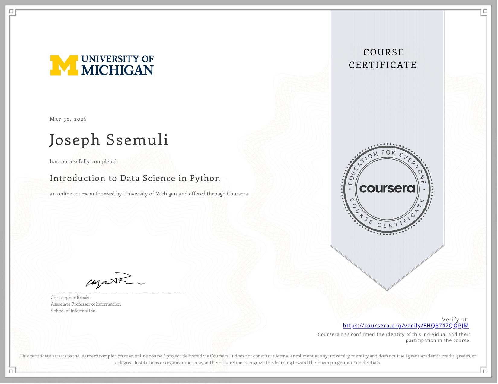

# Applied Data Science with Python - My Journey 🚀

Welcome to my portfolio repository for the **Applied Data Science with Python** course via Coursera (University of Michigan). This repository showcases my progression, hands-on assignments, and the practical data science skills I've developed using Python, Pandas, and NumPy.

## 🏆 Course Certificate

[](https://coursera.org/share/bf402a91d83f2c82f336e01e033cec96)
_Click the image above to view my official verified certificate._

## 🎯 Key Skills Demonstrated

- **Data Manipulation & Cleaning:** Expert manipulation of DataFrames and Series using `pandas`.
- **Numerical Computing:** Efficient array operations and mathematical computations with `numpy`.
- **Text Processing:** Pattern matching and text extraction using Regular Expressions (`regex`).
- **Data Aggregation:** Advanced grouping, merging, and pivot tables.
- **Statistical Analysis:** Basic statistical testing and hypothesis testing.

## 📂 Repository Structure & Curriculum

### Week 1: Python Fundamentals & Data Science Basics

- **Topics:** Lambda functions, List Comprehensions, Regular Expressions (Regex), and an introduction to `numpy`.
- **Highlights:** `Numpy_ed.ipynb`, `Regex_ed.ipynb`, `assignment1.ipynb`

### Week 2: Pandas Data Structures

- **Topics:** Introduction to `pandas`, Series and DataFrame data structures, querying and indexing DataFrames, handling missing values.
- **Highlights:** `DataFrameManipulation_ed.ipynb`, `assignment2.ipynb` (Analyzing census and olympics data).

### Week 3: Advanced Pandas & Data Processing

- **Topics:** Merging DataFrames, GroupBy idioms, Pivot Tables, Date Functionality, and Scales.
- **Highlights:** `MergingDataFrame_ed.ipynb`, `GroupBy_ed.ipynb`, `assignment3.ipynb` (Processing and merging World Bank datasets).

### Week 4: Basic Statistical Analysis

- **Topics:** Distributions, Hypothesis Testing, and T-tests.
- **Highlights:** `BasicStatisticalTesting.ipynb`, `assignment4.ipynb` (Analyzing sports data: MLB, NBA, NFL, NHL, and Wikipedia).

## 🛠️ Tools & Technologies Used

- **Language:** Python 3
- **Libraries:** Pandas, NumPy, SciPy
- **Environment:** Jupyter Notebooks

## 🚀 How to Run

To explore the notebooks in this repository:

1. Clone the repo:
   ```bash
   git clone https://github.com/SsemuliJoseph/Applied-Data-Science-Python-Uni-Michigan.git
   ```
2. Install the required dependencies:
   ```bash
   pip install pandas numpy scipy jupyterlab
   ```
3. Launch Jupyter Notebook:
   ```bash
   jupyter lab
   ```

---

\_Feel free to explore the code! Connect with me on [LinkedIn](https://www.linkedin.com/in/joseph-ssemuli-955048344?utm_source=share_via&utm_content=profile&utm_medium=member_android)
